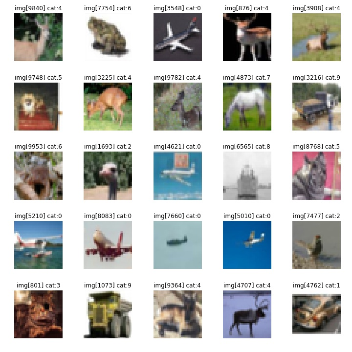
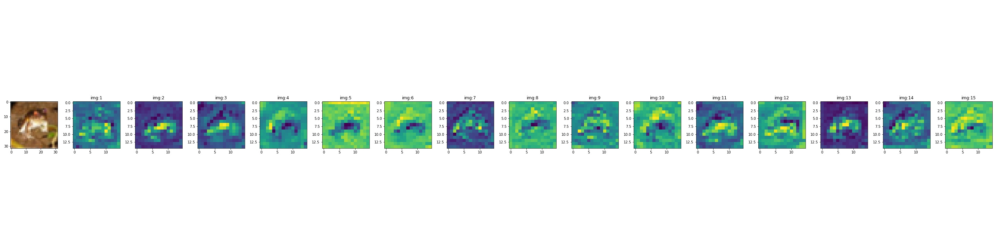

# img_cat

Neural Network Image Categorization

## Motivation 🤓

I wanted to build an image categorizer to investigate the internals of the neural networks. I wanted to know how the image was manipulated as it passed through the network, and ultimately, how the data is manipulated to get an accurate prediction.

## Usage 📖

### Get and Explor the Data
The CIFAR data set ([ http://www.cs.utoronto.ca/%7Ekriz/cifar.html ], Learning Multiple Layers of Features from Tiny Images, Alex Krizhevsky, 2009.) was used for training and testing data sets.
These notebooks provide a few methods for unpacking and visualizing the data. 
Following is a sampling of the data set. 

Included are notebook cells to inspect a specific image in a data set.

The interim data, between layers of an example problem is visualized to illustrate to the user the transforms that occur during an images pass through the network.
Following is an example of the channels output from within the sequential model example.

### Model
The overall structure of the neural network was derived from the following implemenation : [ https://medium.com/towards-artificial-intelligence/image-classification-using-deep-learning-pytorch-a-case-study-with-flower-image-data-80a18554df63 ].

Two types of neural network prediction models were developed, sequential and dense models.
The sequential model primarily follows the aforementioned implementation.
The dense nodes developed here were based on the following implementation : 
[ https://towardsdatascience.com/simple-implementation-of-densely-connected-convolutional-networks-in-pytorch-3846978f2f36 ].

- Both models must be trained first. Specifying the value of `epochs` (and `no_subbat` for memory management), the `train()` method is used to train the model with the CIFAR dats set.
- Save the models, using `save()` at the end of training, so that training can be resumed later.
- Test the accuracy of the models predictions using `test()`.

The

## Future 👨‍💻
- Investigate other 'recipes' for building image classification neural networks.
- Explore prediction neural networks